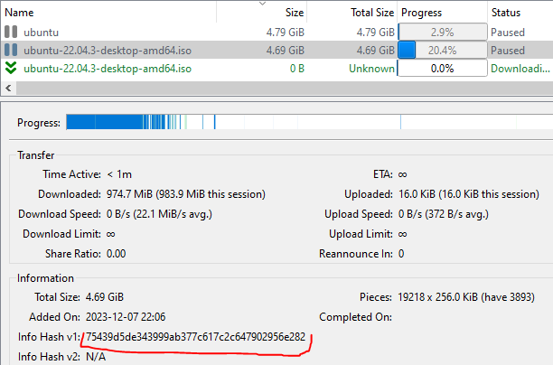
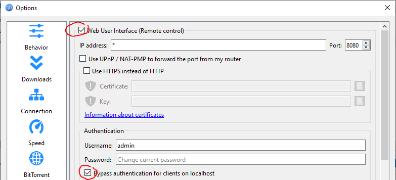

# What is it?

A tool to merge partial downloads in [qBittorrent](https://www.qbittorrent.org/)

Files have to be identical. Overall content of torrent can be different, only identical files will be merged

# Usage
## Building
Install [Rust](https://www.rust-lang.org/)

Clone the repo, and build

```
git clone https://github.com/tatref/qbittorrent-merger
cd qbittorrent-merger/
cargo build --release
```

## Get torrent hashes from qBittorrent



You need hashes from at least two torrents: one will be used as source, the other as destination.

Piece hashes are checked before copying data to files, so mismatching source/destination won't have any bad outcome

## API access

Enable the API, and enable auth bypass for localhost (password is not handled yet)



## Run the tool

```
cargo run --release --bin merge 75439d5de343999ab377c617c2c647902956e282 2dd3f21f3d7709139b589bbf42abd8598deef8a2 ...
```

```
[2023-12-07T22:10:33Z INFO  merge] qBittorrent version: v4.6.2
[2023-12-07T22:10:33Z INFO  merge] src_hash: 75439d5de343999ab377c617c2c647902956e282
[2023-12-07T22:10:33Z INFO  merge] dst_hash: 2dd3f21f3d7709139b589bbf42abd8598deef8a2
[2023-12-07T22:10:33Z INFO  merge] src content:
[2023-12-07T22:10:33Z INFO  merge] 5037662208 ubuntu-22.04.3-desktop-amd64.iso
[2023-12-07T22:10:33Z INFO  merge] dst content:
[2023-12-07T22:10:33Z INFO  merge] 5037662208 ubuntu/ubuntu-22.04.3-desktop-amd64.iso
[2023-12-07T22:10:33Z INFO  merge]  110896736 ubuntu/VirtualBox-7.0.12-159484-Win.exe
[2023-12-07T22:10:33Z INFO  merge] same files: [(["ubuntu-22.04.3-desktop-amd64.iso"], ["ubuntu/ubuntu-22.04.3-desktop-amd64.iso"])]
[2023-12-07T22:10:33Z INFO  merge] Working on ubuntu/ubuntu-22.04.3-desktop-amd64.iso
[2023-12-07T22:10:44Z INFO  merge] Retored pieces: 1597
[2023-12-07T22:10:44Z INFO  merge] Unavailable pieces: 668
[2023-12-07T22:10:44Z INFO  merge] Data outside file block: 0
[2023-12-07T22:10:44Z INFO  merge] Rechecking torrent...
[2023-12-07T22:10:44Z INFO  merge] src_hash: 2dd3f21f3d7709139b589bbf42abd8598deef8a2
[2023-12-07T22:10:44Z INFO  merge] dst_hash: 75439d5de343999ab377c617c2c647902956e282
[2023-12-07T22:10:44Z INFO  merge] src content:
[2023-12-07T22:10:44Z INFO  merge] 5037662208 ubuntu/ubuntu-22.04.3-desktop-amd64.iso
[2023-12-07T22:10:44Z INFO  merge]  110896736 ubuntu/VirtualBox-7.0.12-159484-Win.exe
[2023-12-07T22:10:44Z INFO  merge] dst content:
[2023-12-07T22:10:44Z INFO  merge] 5037662208 ubuntu-22.04.3-desktop-amd64.iso
[2023-12-07T22:10:44Z INFO  merge] same files: [(["ubuntu/ubuntu-22.04.3-desktop-amd64.iso"], ["ubuntu-22.04.3-desktop-amd64.iso"])]
[2023-12-07T22:10:44Z INFO  merge] Working on ubuntu-22.04.3-desktop-amd64.iso
[2023-12-07T22:10:44Z INFO  merge] Retored pieces: 0
[2023-12-07T22:10:44Z INFO  merge] Unavailable pieces: 1855
[2023-12-07T22:10:44Z INFO  merge] Data outside file block: 0
[2023-12-07T22:10:44Z INFO  merge] Please rechecking torrents!
```
